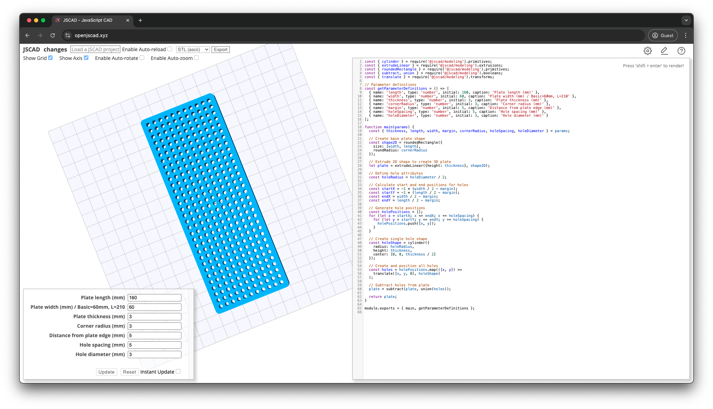

# TAMIYA UNIVERSAL PLATE GENERATOR

This project provides a customizable 3D model generator for [TAMIYA UNIVERSAL PLATE](https://www.tamiya.com/japan/products/70098/index.html) using JSCAD.

## Features

- Adjustable plate dimensions (length, width, thickness)
- Customizable corner radius
- Configurable hole pattern (spacing and diameter)
- Easy-to-use parameter interface

## Example Output

## Contributing

Contributions are welcome! Please feel free to submit a Pull Request.

## License

This project is licensed under the MIT License.